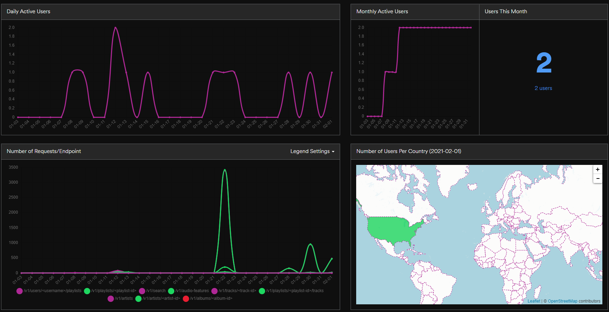
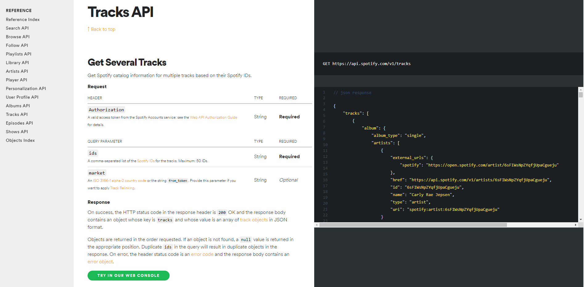

# Spotify API Project

## Introduction 

Plotify!  The project uses data collected from a collaborative playlist dataset created by the Fall/Winter 2020-21 Data Visualization Bootcamp cohort. The aim of the project is to answer several music related questions from the dataset used. The research findings are mostly for fun, may also be extrapolated to market research or continued work on a music application. Initial research questions posed are:  

1.	What is the danceability distribution of songs in the playlist? 
2.	What is the energy distribution of songs in the playlist? 
3.	What is the liveness distribution of songs in the playlist?
4.	What is the music genre distribution of songs in the playlist?
5.	What is the tempo distribution of songs in the playlist?  

Datasets to be used were collected using Spotify’s collaborative playlist function:

Playlist: “Data Analysis Jamz" - https://open.spotify.com/playlist/0fCFwL8LJE99raQb1g2YvF?si=riMLWeEsTeqfAreToKI5_g

## Data Extraction using Python Library – Spotipy

Data was extracted using Python and Spotify’s Python library: Spotipy.  A series of successive API calls were used to pull data from Spotify.  To extract information using Spotipy, Spotify requires that a developer application be setup.  Once setup, the app will issue a Client ID and a Secret Client ID.  Similarly, a redirect URI is required to “bounce” a unique user token to be used with the API calls.  A unique playlist and user ID was required to extract the playlist and audio track information. 

## Backend Logic: Flask and MongoDB

Getting the playlist from Spotify takes one API call, but getting the audio features requires a separate API call for each track. To prevent the user having to wait for hundreds of API calls everytime they load the page, we decided to cache the data in MongoDB using the PyMongo ORM library. 

There are 2 collections in MongoDB: `playlists`, which in this case only contains a single playlist document, and `tracks`, which contains a document for every track with its info (artist, track name, album, user who added it) and audio features. Playlists in Spotify have an attribute called `snapshot_id` that updates when the playlist updates, so we used that to determine when the backend needed to update the `tracks` collection, and when it could just return its contents without any further API calls.

The flow looks like this: Each time the user hits the `"/"` route, the Flask API returns `index.html`. When they get `app.js`, it makes an asynchronous request to the `"/data"` route. That function connects to MongoDB and grabs the current playlist, and also calls Spotify to grab its current playlist, then compares their `snapshot_id`s to see whether it should make the remaining API calls and replace the `tracks` collection with the new data. In either case, it returns all the tracks from MongoDB as JSON.

## Frontend Libraries

For styling, we used Bulma as our CSS library, then customized it by resetting some of its Sass variables on the backend using Libsass middleware.  We chose Bulma because it's lightweight, but still has a variety of option and styles available. The page format we chose was the Bulma Hero as the banner container allowed us to include links for both Spotify and the playlist websites as well as active tabs for both the playlist and overview which shows the definitions of each of the objects being compared. Spotify has their color scheme and logo available so we were able to include each of these items on our site for authenticity.

We also used Vue.js, hydrated upon page load via the Vue CDN, for state management and reactivity:

- The AJAX request to the `/data` route is made within the `created` lifecycle hook of the Vue instance
- `<scatter>` is one of 3 custom components that will display based on the outcome; the other 2 are `<loading-spinner>` (when `loading = true`, the initial state) and `<error>` (when `loading = false` and `error` has a value, set in the `catch` block); if neither condition is met - ie, `loading = false` and `error = null` - the `scatter` component will be created
- All the D3 scripts to set the linear scales for the axes and populate the circles happens in the `mounted` lifecycle hook on the `<scatter>` component
- The currently selected `x` and `y` axes, as well as the computed `selectedUsers`, are watched properties; change to either triggers the chart to update
- Each of the form controls (selected axis dropdowns and user checkboxes) have `v-model` attributes to bind them to their values on the Vue instance
- Similar logic is also used to keep track of the active tab and selectively render the chart or overview, as well as update the `is-active` class on the tabs themselves

Integrating Vue and D3 was a fun challenge. Even though they feel like a good fit for each other, there are very few examples of implementation. It would be interesting to cut out D3 for most of the rendering and just use some parts, like its linear scale functionality, and instead have Vue generate and bind the axes and circle components.

## Deployment

To bring all this to fruition, we needed somewhere to deploy our full-stack Flask application. We chose Heroku as our hosting platform, MongoDB Atlas to host our database, and implemented Pipenv for environment/dependency management. Mongo needs a static IP to whitelist, so we also implemented Fixie Socks to generate a static IP for Heroku. The app has a staging and production version for CI/CD, which was a bit of overkill, but it's always a good idea to think ahead.

## Future Features

There is a lot more data in the Spotify API to explore. One aspect we looked at was genres, but the categories are too granular - eg, "Australian Psych" - to be meaningful even using the most sophisticated visualizations. This is a good use case for machine learning to perform some categorization analysis, so we are considering expanding upon this for our final class project.