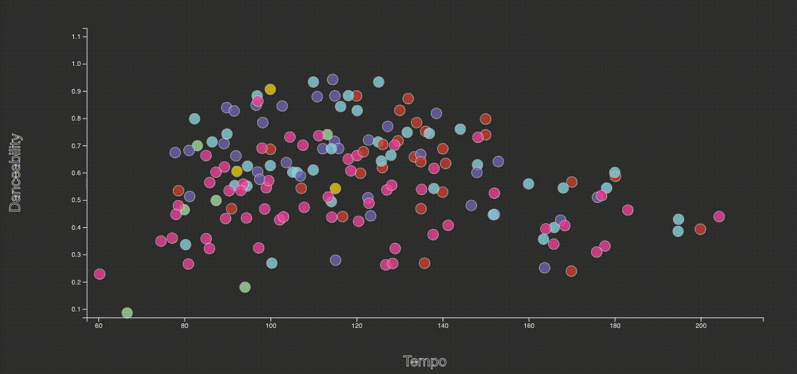
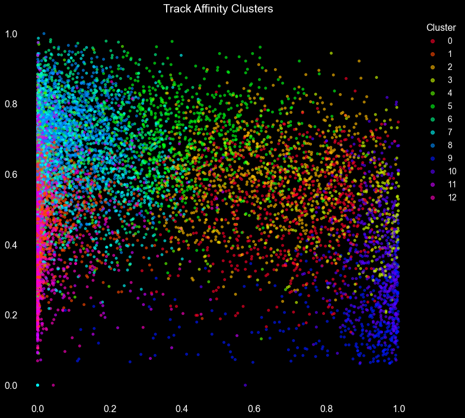

# Spotify API Project

### Introduction 

For our final project, we expanded upon our Plotify app (previously built for the D3 data visualization project) to include machine learning with Scikit-Learn. The goal was to produce a sequential deep neural network model that could reasonably predict something qualitative about a song by feeding it the quantitative data provided by the Spotify developer API. We used genre prediction as a proof-of-concept to develop the model, with the ultimate goal of being able to train it to make recommendations.

### Recap: Project 1

In the previous iteration, we created a collaborative [Data Analysis Jamz](https://open.spotify.com/playlist/0fCFwL8LJE99raQb1g2YvF?si=riMLWeEsTeqfAreToKI5_g) playlist and invited the class to contribute tracks. We then used ETL to grab "audio features" about each track from the Spotify developer API - things like *energy* and *acousticness* - and create a dynamic scatter plot for users to explore the attributes of the playlist, color-coded by the user that added them:

The application is built with Flask, hosted on Heroku, and uses Pipenv for dependency and environment management. We stored the data in MongoDB Cloud and used PyMongo to access the data from within the Flask routes. The frontend is built with HTML and very limited Jinja2 for static file URLs. All the Javascript was written within a Vue instance, hydrated using the Vue CDN. For styling, we used Bulma with some SCSS customization via Libsass middleware to allow us to customize the color scheme.

### Expanding the ETL

In order to do some more complex analysis, we needed to an automated way to rapidly expand our dataset, so we used the *Get Recommendations* endpoint. You supply any combination of 5 tracks, artists, and genres, and it returns up to 100 recommended tracks. We investigated how this works by supplying it all the tracks from our original playlist, and added a tab to the site so users could see how we went about retrieve the additional data. As with the tracks in the data visualization, we extracted and transformed the track attributes and metadata, then cached them in MongoDB.

Brief recap on Spotify developer API: Data was extracted using Python and Spotify’s Python library: Spotipy. A series of successive API calls were used to pull data from Spotify. To extract information using Spotipy, Spotify requires that a developer application be setup.  Once setup, the app will issue a Client ID and a Secret Client ID. Similarly, a redirect URI is required to “bounce” a unique user token to be used with the API calls. A unique playlist and user ID was required to extract the playlist and audio track information. 

## Machine Learning

### Genre dataset

In order to get a more evenly-distributed dataset for genre prediction, we fed 50 different genres into the *Get Recommendations* endpoint, then fed the 100 tracks returned from each call to the *Get Audio Features for Several Tracks* endpoint. We used Pandas to create a master Dataframe, then used MinMaxScalar to normalize each audio feature.

### Affinity Propagation

To get a sense of how predictive audio features would be for genres, we fed the data into an affinity propagation model. It's similar to K-Means, but instead of telling the algorithm to separate the data into a specific number of clusters (K), affinity propagation lets each point compete for the title of Exemplar. For those who follow politics, this is similar to a caucus, but one where every person starts as a candidate, then over the course of several dozen iterations, they gradually coalesce around a finite number of candidates (the ones with the most *responsibility*) and all the other points figure out which candidate they support (the one they have the most *affinity* for). In the end, it's the points that figure out how many candidates they end up with; the only thing the programmer dictates is how much *preference* all the points should have - ie, how confident they should be that they're a candidate.

Raising the preference will eventually mean every point thinks it's a candidate, which isn't very useful, but lowering it too much might cause them all to coalesce around just 1 candidate, so the tricky part is finding the right balance. In this case, we didn't want too few clusters, but there's a level below which this many points no longer achieve any consensus - somewhere around -37 - which resulted in 13 clusters:

How did it do? Overall, pretty well, but results were mixed. Certain clusters were highly uniform in their genre distribution, especially towards either end of the spectrum. Cluster 12 was almost all some variation on electronic dance music (techno, house, trance), while cluster 10 was almost all classical. On the other end, the first few clusters separated out into rock, punk, metal, and indie fairly neatly. The middle third showed some patterns, but there was a lot more spillover between Latin, reggae/dancehall, Indian, and other "world" genres, as well as hip-hop and R&B, but each cluster still had some distinct identity.

### Genre Predictor

The final goal was to create a model that could do some predicting. We could have used the affinity propagation model to predict by cluster - which as shown would have been a good way of doing things - but we wanted to see how a sequential deep neural network model would fare.

First, we needed to do some more cleanup on the data. Each track has a list of several genres, and the genres themselves are extremely granular, to the point where 10k songs had a total of over 1k genres. We went through and looked at which keywords were most distinctive for each cluster and iterated over the dataset to select for those terms, followed by progressively less distinctive terms, until each track only had 1 term associated with it. This worked ok, but it's also the single biggest area for improvement, so we'd like to return to this using some more sophisticated machine learning to accomplish this step.

Next, we split the tracks into training and testing data and fed the training data into a sequential deep learning model using 2 hidden layers with ReLu, then a SoftMax output layer. The model achieved close to 100% accuracy on the training data after about 400 epochs, and had about 75% accuracy when applied to the testing data. We then saved the model, along with the scalar and label encoder, and loaded them into our Flask app.

On the frontend, when the user enters a track and/or artist and clicks *submit*, the Vue application sends that information to the *genre-predict* Flask route, which queries the Spotify API's *Search* endpoint to get the first track returned, then gets the genres and audio features for that track. It applies the scalar to the audio features and runs it through the model to get the predicted genre, then sends that back to the user along with the actual genres and other song info.

In practice, this is somewhat effective, but as mentioned above, the current limitations aren't really in the model itself, but the specificity and accuracy of the training data fed to it.

## Conclusions

Spotify's API provides a budding data scientist with a wealth of useful information with a variety of potential applications for machine learning models. We only just scratched the surface, and we hope to expand upon this in the future by applying additional techniques to parse categories to make the predictor more accurate. That would open up avenues to more sophisticated applications, such as creating a recommendations model.